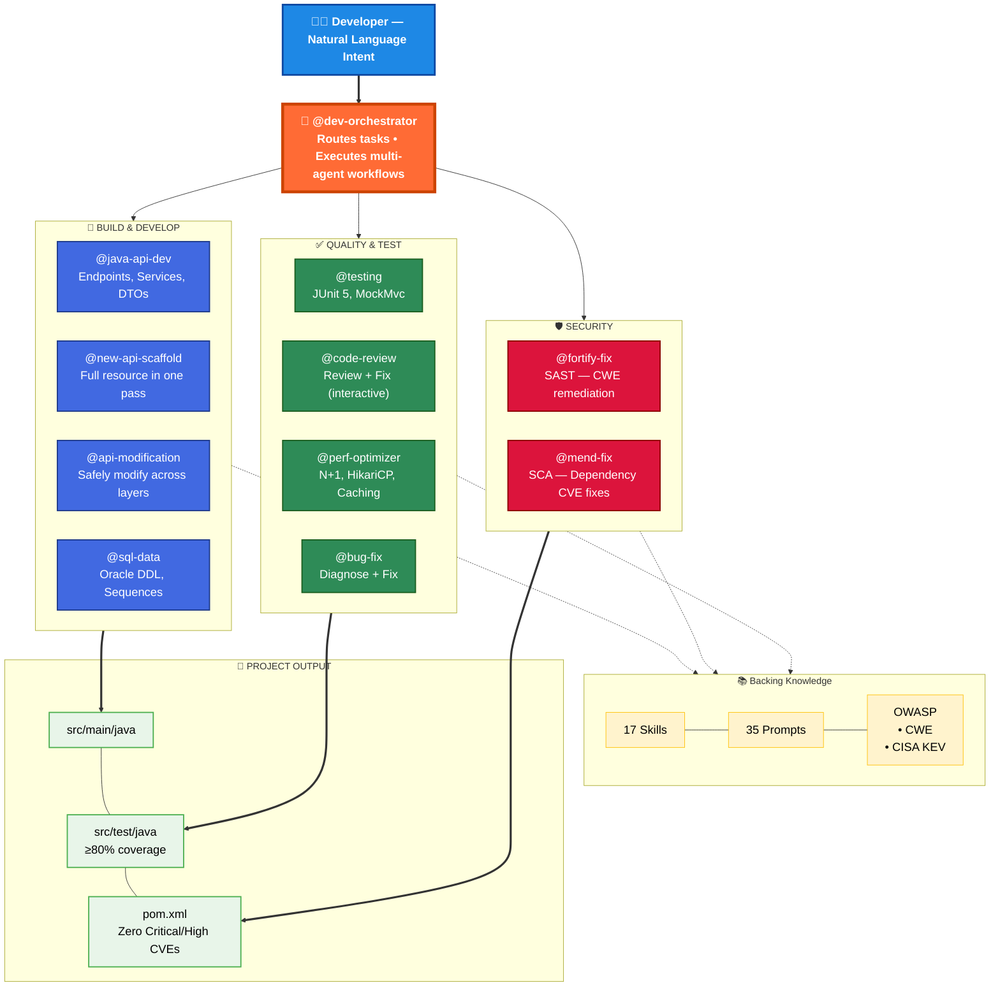
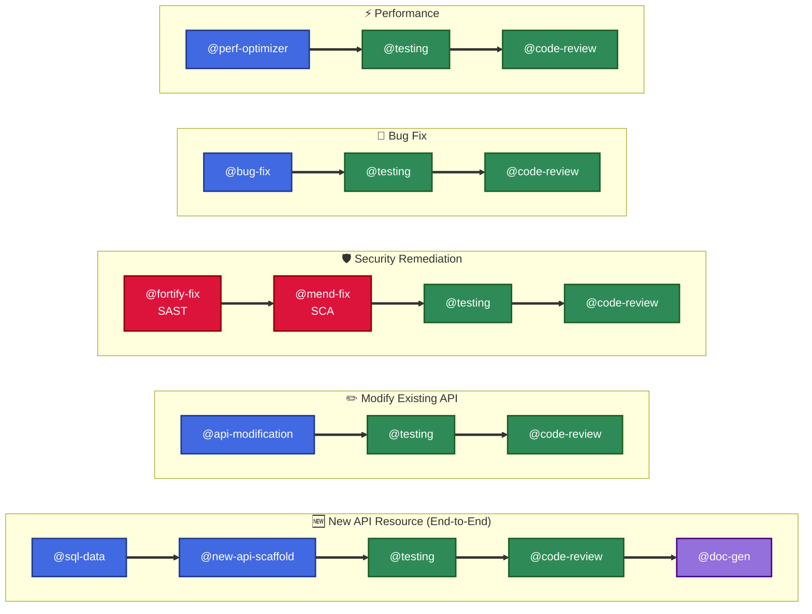

# Agentic Development Approach — Java Spring Boot API

> **14 specialized AI agents** orchestrated to handle the full SDLC for Java Spring Boot REST APIs with Oracle Database.

---

## Slide 1: Architecture Overview — Agent Ecosystem

---

## Slide 2: Workflow Pipelines — How Agents Chain Together

---

## Key Talking Points

| Principle | Implementation |
|-----------|---------------|
| **Single Responsibility** | Each agent owns one concern (build, test, secure, review, document) |
| **Chain of Verification** | Every workflow ends with `@testing` → `@code-review` |
| **Security by Default** | `@fortify-fix` (SAST) + `@mend-fix` (SCA) aligned to OWASP 2025 / CISA KEV |
| **Knowledge-Backed** | 17 skills + 35 prompts provide domain expertise — no hallucination |
| **Minimal Change** | Agents apply smallest fix — no speculative refactoring |
| **Human-in-the-Loop** | Developer provides intent → agents execute → `@code-review` validates |
