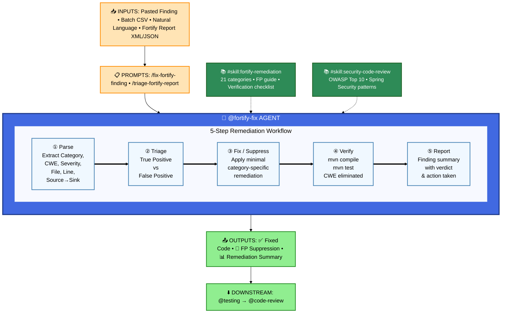

```mermaid
---
config:
  theme: base
  themeVariables:
    fontSize: 18px
    fontFamily: Arial
---
flowchart TB
    %% ===== STYLING =====
    classDef input fill:#FFE4B5,stroke:#FF8C00,stroke-width:2px,color:#000,font-size:16px
    classDef agent fill:#4169E1,stroke:#1E3A8A,stroke-width:3px,color:#fff,font-size:18px
    classDef skill fill:#2E8B57,stroke:#1B5E20,stroke-width:2px,color:#fff,font-size:15px
    classDef step fill:#F0F8FF,stroke:#4682B4,stroke-width:2px,color:#000,font-size:16px
    classDef output fill:#90EE90,stroke:#228B22,stroke-width:2px,color:#000,font-size:16px

    %% ===== INPUTS =====
    IN["📥 INPUTS: Pasted Finding • Batch CSV • Natural Language • Fortify Report XML/JSON"]
    PR["📋 PROMPTS: /fix-fortify-finding • /triage-fortify-report"]

    %% ===== AGENT + WORKFLOW =====
    IN --> PR
    PR --> AGENT

    subgraph AGENT["🤖  @fortify-fix  AGENT"]
        direction TB
        subgraph WORKFLOW["5-Step Remediation Workflow"]
            direction LR
            S1["① Parse<br/>Extract Category,<br/>CWE, Severity,<br/>File, Line,<br/>Source→Sink"]
            S2["② Triage<br/>True Positive<br/>vs<br/>False Positive"]
            S3["③ Fix / Suppress<br/>Apply minimal<br/>category-specific<br/>remediation"]
            S4["④ Verify<br/>mvn compile<br/>mvn test<br/>CWE eliminated"]
            S5["⑤ Report<br/>Finding summary<br/>with verdict<br/>& action taken"]
            S1 ==> S2 ==> S3 ==> S4 ==> S5
        end
    end

    %% ===== SKILLS (feeds into agent from side) =====
    SK1["📚 #skill:fortify-remediation\n21 categories • FP guide • Verification checklist"]
    SK2["📚 #skill:security-code-review\nOWASP Top 10 • Spring Security patterns"]

    SK1 -.-> AGENT
    SK2 -.-> AGENT

    %% ===== OUTPUTS =====
    AGENT --> OUT

    OUT["📤 OUTPUTS: ✅ Fixed Code • 📝 FP Suppression • 📊 Remediation Summary"]

    %% ===== DOWNSTREAM =====
    OUT --> DS["⬇️ DOWNSTREAM: @testing → @code-review"]

    %% ===== APPLY STYLES =====
    class IN,PR input
    class AGENT agent
    class SK1,SK2 skill
    class S1,S2,S3,S4,S5 step
    class OUT output
    class DS output
```
