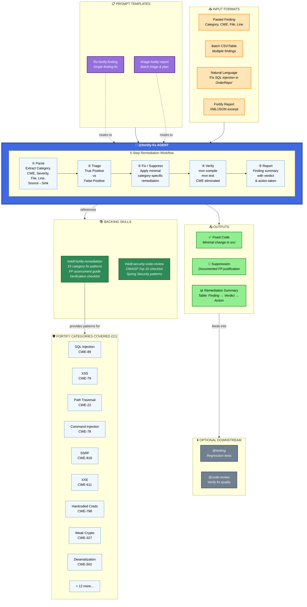

```mermaid
flowchart TB
    %% ===== STYLING =====
    classDef input fill:#FFE4B5,stroke:#FF8C00,stroke-width:2px,color:#000
    classDef agent fill:#4169E1,stroke:#1E3A8A,stroke-width:3px,color:#fff,font-weight:bold
    classDef skill fill:#2E8B57,stroke:#1B5E20,stroke-width:2px,color:#fff
    classDef prompt fill:#9370DB,stroke:#4B0082,stroke-width:2px,color:#fff
    classDef step fill:#F0F8FF,stroke:#4682B4,stroke-width:1px,color:#000
    classDef output fill:#90EE90,stroke:#228B22,stroke-width:2px,color:#000
    classDef downstream fill:#708090,stroke:#2F4F4F,stroke-width:2px,color:#fff

    %% ===== USER INPUT =====
    subgraph INPUTS["📥 INPUT FORMATS"]
        direction LR
        I1["Pasted Finding<br/><i>Category, CWE, File, Line</i>"]
        I2["Batch CSV/Table<br/><i>Multiple findings</i>"]
        I3["Natural Language<br/><i>'Fix SQL injection in OrderRepo'</i>"]
        I4["Fortify Report<br/><i>XML/JSON excerpt</i>"]
    end

    %% ===== PROMPT TEMPLATES =====
    subgraph PROMPTS["📋 PROMPT TEMPLATES"]
        direction LR
        P1["/fix-fortify-finding<br/><i>Single finding fix</i>"]
        P2["/triage-fortify-report<br/><i>Batch triage & plan</i>"]
    end

    %% ===== AGENT =====
    subgraph AGENT["🤖 @fortify-fix AGENT"]
        direction TB
        subgraph WORKFLOW["5-Step Remediation Workflow"]
            direction LR
            S1["① Parse<br/>Extract Category,<br/>CWE, Severity,<br/>File, Line,<br/>Source→Sink"]
            S2["② Triage<br/>True Positive<br/>vs<br/>False Positive"]
            S3["③ Fix / Suppress<br/>Apply minimal<br/>category-specific<br/>remediation"]
            S4["④ Verify<br/>mvn compile<br/>mvn test<br/>CWE eliminated"]
            S5["⑤ Report<br/>Finding summary<br/>with verdict<br/>& action taken"]
            S1 --> S2 --> S3 --> S4 --> S5
        end
    end

    %% ===== SKILLS =====
    subgraph SKILLS["📚 BACKING SKILLS"]
        direction TB
        SK1["#skill:fortify-remediation<br/><i>19 category fix patterns</i><br/><i>FP assessment guide</i><br/><i>Verification checklist</i>"]
        SK2["#skill:security-code-review<br/><i>OWASP Top 10 checklist</i><br/><i>Spring Security patterns</i>"]
    end

    %% ===== CATEGORY COVERAGE =====
    subgraph CATEGORIES["🛡️ FORTIFY CATEGORIES COVERED (21)"]
        direction LR
        C1["SQL Injection<br/>CWE-89"]
        C2["XSS<br/>CWE-79"]
        C3["Path Traversal<br/>CWE-22"]
        C4["Command Injection<br/>CWE-78"]
        C5["SSRF<br/>CWE-918"]
        C6["XXE<br/>CWE-611"]
        C7["Hardcoded Creds<br/>CWE-798"]
        C8["Weak Crypto<br/>CWE-327"]
        C9["Deserialization<br/>CWE-502"]
        C10["+ 12 more..."]
    end

    %% ===== OUTPUTS =====
    subgraph OUTPUTS["📤 OUTPUTS"]
        direction LR
        O1["✅ Fixed Code<br/><i>Minimal change in src/</i>"]
        O2["📝 Suppression<br/><i>Documented FP justification</i>"]
        O3["📊 Remediation Summary<br/><i>Table: Finding → Verdict → Action</i>"]
    end

    %% ===== DOWNSTREAM =====
    subgraph DOWNSTREAM["⬇️ OPTIONAL DOWNSTREAM"]
        direction LR
        D1["@testing<br/><i>Regression tests</i>"]
        D2["@code-review<br/><i>Verify fix quality</i>"]
    end

    %% ===== CONNECTIONS =====
    INPUTS --> AGENT
    PROMPTS --> AGENT
    P1 -.->|"routes to"| AGENT
    P2 -.->|"routes to"| AGENT
    AGENT -->|"references"| SKILLS
    SK1 -->|"provides patterns for"| CATEGORIES
    AGENT --> OUTPUTS
    OUTPUTS -->|"feeds into"| DOWNSTREAM

    %% ===== APPLY STYLES =====
    class I1,I2,I3,I4 input
    class AGENT agent
    class SK1,SK2 skill
    class P1,P2 prompt
    class S1,S2,S3,S4,S5 step
    class O1,O2,O3 output
    class D1,D2 downstream
    class C1,C2,C3,C4,C5,C6,C7,C8,C9,C10 step
```
