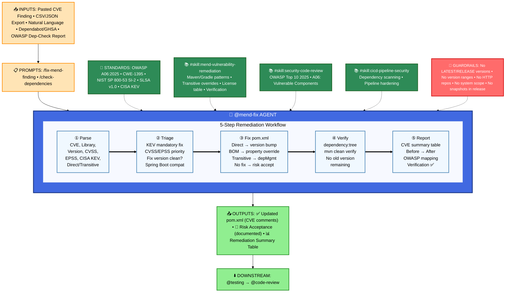

```mermaid
---
config:
  theme: base
  themeVariables:
    fontSize: 18px
    fontFamily: Arial
---
flowchart TB
    %% ===== STYLING =====
    classDef input fill:#FFE4B5,stroke:#FF8C00,stroke-width:2px,color:#000,font-size:16px
    classDef agent fill:#4169E1,stroke:#1E3A8A,stroke-width:3px,color:#fff,font-size:18px
    classDef skill fill:#2E8B57,stroke:#1B5E20,stroke-width:2px,color:#fff,font-size:15px
    classDef step fill:#F0F8FF,stroke:#4682B4,stroke-width:2px,color:#000,font-size:16px
    classDef output fill:#90EE90,stroke:#228B22,stroke-width:2px,color:#000,font-size:16px
    classDef guardrail fill:#FF6B6B,stroke:#CC0000,stroke-width:2px,color:#fff,font-size:14px

    %% ===== INPUTS =====
    IN["📥 INPUTS: Pasted CVE Finding • CSV/JSON Export • Natural Language • Dependabot/GHSA • OWASP Dep-Check Report"]
    PR["📋 PROMPTS: /fix-mend-finding • /check-dependencies"]

    %% ===== STANDARDS =====
    STD["📐 STANDARDS: OWASP A06:2025 • CWE-1395 • NIST SP 800-53 SI-2 • SLSA v1.0 • CISA KEV"]

    %% ===== AGENT + WORKFLOW =====
    IN --> PR
    PR --> AGENT
    STD -.-> AGENT

    subgraph AGENT["🤖  @mend-fix  AGENT"]
        direction TB
        subgraph WORKFLOW["5-Step Remediation Workflow"]
            direction LR
            S1["① Parse<br/>CVE, Library,<br/>Version, CVSS,<br/>EPSS, CISA KEV,<br/>Direct/Transitive"]
            S2["② Triage<br/>KEV mandatory fix<br/>CVSS/EPSS priority<br/>Fix version clean?<br/>Spring Boot compat"]
            S3["③ Fix pom.xml<br/>Direct → version bump<br/>BOM → property override<br/>Transitive → depMgmt<br/>No fix → risk accept"]
            S4["④ Verify<br/>dependency:tree<br/>mvn clean verify<br/>No old version<br/>remaining"]
            S5["⑤ Report<br/>CVE summary table<br/>Before → After<br/>OWASP mapping<br/>Verification ✅"]
            S1 ==> S2 ==> S3 ==> S4 ==> S5
        end
    end

    %% ===== SKILLS (feeds into agent from side) =====
    SK1["📚 #skill:mend-vulnerability-remediation\nMaven/Gradle patterns • Transitive overrides • License table • Verification"]
    SK2["📚 #skill:security-code-review\nOWASP Top 10 2025 • A06: Vulnerable Components"]
    SK3["📚 #skill:cicd-pipeline-security\nDependency scanning • Pipeline hardening"]

    SK1 -.-> AGENT
    SK2 -.-> AGENT
    SK3 -.-> AGENT

    %% ===== GUARDRAILS =====
    GR["🚫 GUARDRAILS: No LATEST/RELEASE versions • No version ranges • No HTTP repos • No system scope • No snapshots in release"]
    GR -.-> AGENT

    %% ===== OUTPUTS =====
    AGENT --> OUT

    OUT["📤 OUTPUTS: ✅ Updated pom.xml (CVE comments) • 📝 Risk Acceptance (documented) • 📊 Remediation Summary Table"]

    %% ===== DOWNSTREAM =====
    OUT --> DS["⬇️ DOWNSTREAM: @testing → @code-review"]

    %% ===== APPLY STYLES =====
    class IN,PR input
    class AGENT agent
    class SK1,SK2,SK3 skill
    class S1,S2,S3,S4,S5 step
    class OUT output
    class DS output
    class STD skill
    class GR guardrail
```
