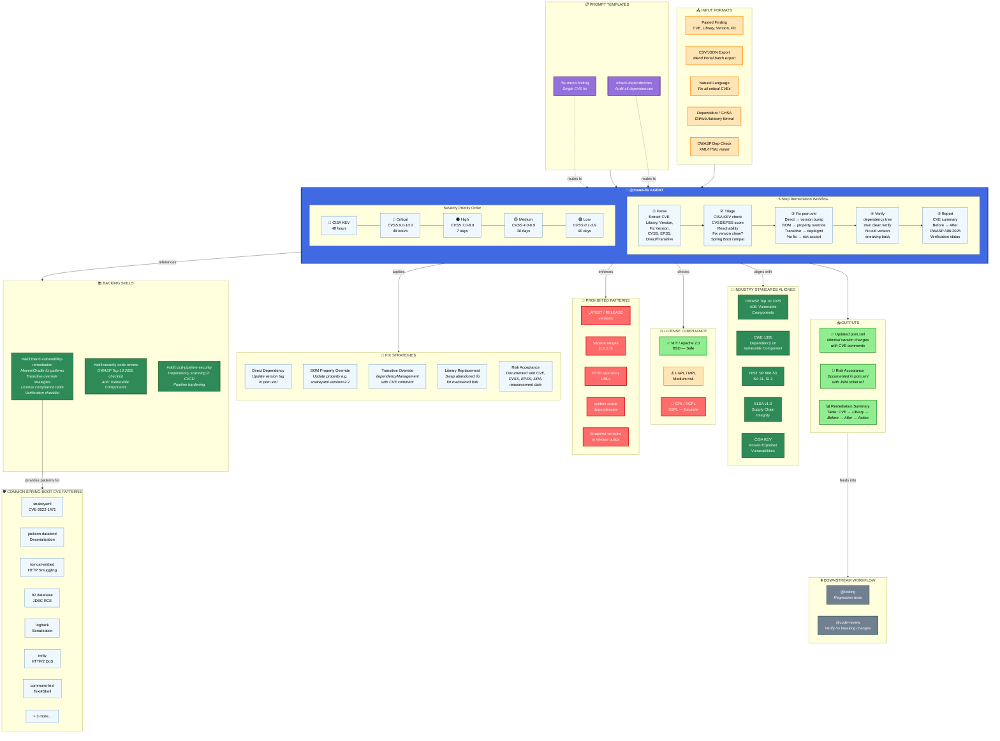

```mermaid
flowchart TB
    %% ===== STYLING =====
    classDef input fill:#FFE4B5,stroke:#FF8C00,stroke-width:2px,color:#000
    classDef agent fill:#4169E1,stroke:#1E3A8A,stroke-width:3px,color:#fff,font-weight:bold
    classDef skill fill:#2E8B57,stroke:#1B5E20,stroke-width:2px,color:#fff
    classDef prompt fill:#9370DB,stroke:#4B0082,stroke-width:2px,color:#fff
    classDef step fill:#F0F8FF,stroke:#4682B4,stroke-width:1px,color:#000
    classDef output fill:#90EE90,stroke:#228B22,stroke-width:2px,color:#000
    classDef downstream fill:#708090,stroke:#2F4F4F,stroke-width:2px,color:#fff
    classDef guardrail fill:#FF6B6B,stroke:#CC0000,stroke-width:2px,color:#fff

    %% ===== USER INPUT =====
    subgraph INPUTS["📥 INPUT FORMATS"]
        direction LR
        I1["Pasted Finding<br/><i>CVE, Library, Version, Fix</i>"]
        I2["CSV/JSON Export<br/><i>Mend Portal batch export</i>"]
        I3["Natural Language<br/><i>'Fix all critical CVEs'</i>"]
        I4["Dependabot / GHSA<br/><i>GitHub Advisory format</i>"]
        I5["OWASP Dep-Check<br/><i>XML/HTML report</i>"]
    end

    %% ===== PROMPT TEMPLATES =====
    subgraph PROMPTS["📋 PROMPT TEMPLATES"]
        direction LR
        P1["/fix-mend-finding<br/><i>Single CVE fix</i>"]
        P2["/check-dependencies<br/><i>Audit all dependencies</i>"]
    end

    %% ===== AGENT =====
    subgraph AGENT["🤖 @mend-fix AGENT"]
        direction TB
        subgraph WORKFLOW["5-Step Remediation Workflow"]
            direction LR
            S1["① Parse<br/>Extract CVE,<br/>Library, Version,<br/>Fix Version,<br/>CVSS, EPSS,<br/>Direct/Transitive"]
            S2["② Triage<br/>CISA KEV check<br/>CVSS/EPSS score<br/>Reachability<br/>Fix version clean?<br/>Spring Boot compat"]
            S3["③ Fix pom.xml<br/>Direct → version bump<br/>BOM → property override<br/>Transitive → depMgmt<br/>No fix → risk accept"]
            S4["④ Verify<br/>dependency:tree<br/>mvn clean verify<br/>No old version<br/>sneaking back"]
            S5["⑤ Report<br/>CVE summary<br/>Before → After<br/>OWASP A06:2025<br/>Verification status"]
            S1 --> S2 --> S3 --> S4 --> S5
        end

        subgraph PRIORITY["Severity Priority Order"]
            direction LR
            PR1["🔴 CISA KEV<br/><i>48 hours</i>"]
            PR2["🔴 Critical<br/><i>CVSS 9.0-10.0</i><br/><i>48 hours</i>"]
            PR3["🟠 High<br/><i>CVSS 7.0-8.9</i><br/><i>7 days</i>"]
            PR4["🟡 Medium<br/><i>CVSS 4.0-6.9</i><br/><i>30 days</i>"]
            PR5["🟢 Low<br/><i>CVSS 0.1-3.9</i><br/><i>90 days</i>"]
            PR1 --- PR2 --- PR3 --- PR4 --- PR5
        end
    end

    %% ===== SKILLS =====
    subgraph SKILLS["📚 BACKING SKILLS"]
        direction TB
        SK1["#skill:mend-vulnerability-remediation<br/><i>Maven/Gradle fix patterns</i><br/><i>Transitive override strategies</i><br/><i>License compliance table</i><br/><i>Verification checklist</i>"]
        SK2["#skill:security-code-review<br/><i>OWASP Top 10 2025 checklist</i><br/><i>A06: Vulnerable Components</i>"]
        SK3["#skill:cicd-pipeline-security<br/><i>Dependency scanning in CI/CD</i><br/><i>Pipeline hardening</i>"]
    end

    %% ===== FIX STRATEGIES =====
    subgraph STRATEGIES["🔧 FIX STRATEGIES"]
        direction TB
        F1["Direct Dependency<br/><i>Update version tag<br/>in pom.xml</i>"]
        F2["BOM Property Override<br/><i>Update property e.g.<br/>snakeyaml.version=2.2</i>"]
        F3["Transitive Override<br/><i>dependencyManagement<br/>with CVE comment</i>"]
        F4["Library Replacement<br/><i>Swap abandoned lib<br/>for maintained fork</i>"]
        F5["Risk Acceptance<br/><i>Documented with CVE,<br/>CVSS, EPSS, JIRA,<br/>reassessment date</i>"]
    end

    %% ===== COMMON CVE PATTERNS =====
    subgraph CVEPATTERNS["🛡️ COMMON SPRING BOOT CVE PATTERNS"]
        direction LR
        CV1["snakeyaml<br/>CVE-2022-1471"]
        CV2["jackson-databind<br/>Deserialization"]
        CV3["tomcat-embed<br/>HTTP Smuggling"]
        CV4["h2 database<br/>JDBC RCE"]
        CV5["logback<br/>Serialization"]
        CV6["netty<br/>HTTP/2 DoS"]
        CV7["commons-text<br/>Text4Shell"]
        CV8["+ 3 more..."]
    end

    %% ===== GUARDRAILS =====
    subgraph GUARDRAILS["🚫 PROHIBITED PATTERNS"]
        direction LR
        G1["LATEST / RELEASE<br/>versions"]
        G2["Version ranges<br/>[1.0,2.0)"]
        G3["HTTP repository<br/>URLs"]
        G4["system scope<br/>dependencies"]
        G5["Snapshot versions<br/>in release builds"]
    end

    %% ===== LICENSE COMPLIANCE =====
    subgraph LICENSE["⚖️ LICENSE COMPLIANCE"]
        direction LR
        L1["✅ MIT / Apache 2.0<br/>BSD — Safe"]
        L2["⚠️ LGPL / MPL<br/>Medium risk"]
        L3["🚫 GPL / AGPL<br/>SSPL — Escalate"]
    end

    %% ===== OUTPUTS =====
    subgraph OUTPUTS["📤 OUTPUTS"]
        direction LR
        O1["✅ Updated pom.xml<br/><i>Minimal version changes<br/>with CVE comments</i>"]
        O2["📝 Risk Acceptance<br/><i>Documented in pom.xml<br/>with JIRA ticket ref</i>"]
        O3["📊 Remediation Summary<br/><i>Table: CVE → Library →<br/>Before → After → Action</i>"]
    end

    %% ===== DOWNSTREAM =====
    subgraph DOWNSTREAM["⬇️ DOWNSTREAM WORKFLOW"]
        direction LR
        D1["@testing<br/><i>Regression tests</i>"]
        D2["@code-review<br/><i>Verify no breaking changes</i>"]
    end

    %% ===== STANDARDS =====
    subgraph STANDARDS["📐 INDUSTRY STANDARDS ALIGNED"]
        direction LR
        ST1["OWASP Top 10 2025<br/>A06: Vulnerable<br/>Components"]
        ST2["CWE-1395<br/>Dependency on<br/>Vulnerable Component"]
        ST3["NIST SP 800-53<br/>SA-11, SI-2"]
        ST4["SLSA v1.0<br/>Supply Chain<br/>Integrity"]
        ST5["CISA KEV<br/>Known Exploited<br/>Vulnerabilities"]
    end

    %% ===== CONNECTIONS =====
    INPUTS --> AGENT
    PROMPTS --> AGENT
    P1 -.->|"routes to"| AGENT
    P2 -.->|"routes to"| AGENT
    AGENT -->|"references"| SKILLS
    AGENT -->|"applies"| STRATEGIES
    SK1 -->|"provides patterns for"| CVEPATTERNS
    AGENT -->|"enforces"| GUARDRAILS
    AGENT -->|"checks"| LICENSE
    AGENT -->|"aligns with"| STANDARDS
    AGENT --> OUTPUTS
    OUTPUTS -->|"feeds into"| DOWNSTREAM

    %% ===== APPLY STYLES =====
    class I1,I2,I3,I4,I5 input
    class AGENT agent
    class SK1,SK2,SK3 skill
    class P1,P2 prompt
    class S1,S2,S3,S4,S5 step
    class PR1,PR2,PR3,PR4,PR5 step
    class O1,O2,O3 output
    class D1,D2 downstream
    class F1,F2,F3,F4,F5 step
    class CV1,CV2,CV3,CV4,CV5,CV6,CV7,CV8 step
    class G1,G2,G3,G4,G5 guardrail
    class L1 output
    class L2 input
    class L3 guardrail
    class ST1,ST2,ST3,ST4,ST5 skill
```
